# Progressive GAN - CelebA High Quality Dataset

A PyTorch implementation of Progressive GAN (ProGAN) trained on the CelebA High Quality dataset. This implementation generates photorealistic face images by progressively increasing resolution from 4x4 to 1024x1024 pixels, ensuring stable training and high-quality output.

## Theory

**Progressive GAN** revolutionizes GAN training by starting with low-resolution images and progressively adding layers to increase resolution. This approach provides several key advantages:

- **Stable Training**: Starting small allows the network to learn basic features before tackling complex details
- **Faster Convergence**: Progressive training is more efficient than training high-resolution GANs from scratch
- **Better Quality**: The progressive approach reduces mode collapse and improves final image quality

### Architecture Overview

**Generator Architecture:**
- Begins with a 4x4 pixel image generation from random noise (512-dimensional latent vector)
- Uses **Weight-Scaled Convolutions (WSConv2d)** for training stability
- Implements **Pixel-wise Normalization** instead of batch normalization to prevent covariate shift
- Progressively adds upsampling layers to reach target resolutions: 4x4 → 8x8 → 16x16 → 32x32 → 64x64 → 128x128 → 256x256 → 512x512 → 1024x1024
- **Fade-in mechanism** smoothly transitions between resolution steps using alpha blending

**Discriminator Architecture:**
- Mirrors the generator but works in reverse (1024x1024 → 4x4)
- Uses **Average Pooling** for downsampling operations
- Implements **Minibatch Standard Deviation** layer to encourage diversity and prevent mode collapse
- **Weight-scaled convolutions** maintain training stability across all resolution steps
- **Gradient Penalty (WGAN-GP)** loss for improved training dynamics

### Key Technical Features

- **Weight Scaling**: Normalizes weights at runtime rather than using traditional normalization layers
- **Progressive Growing**: New layers are gradually faded in using alpha blending (α ∈ [0,1])
- **Equalized Learning Rate**: All layers learn at similar rates regardless of depth
- **Minibatch Standard Deviation**: Encourages generator to produce diverse samples

## Training Results

The model was trained progressively across multiple resolution steps. Below are the generated samples at various training stages:

### Step 0 - 4x4 Resolution
**Epoch 1:**
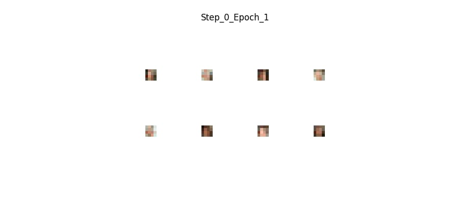

**Epoch 2:**
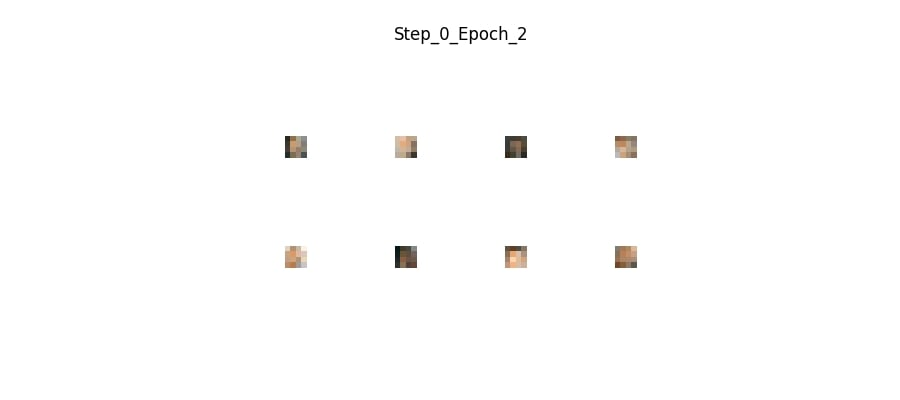

**Epoch 3:**
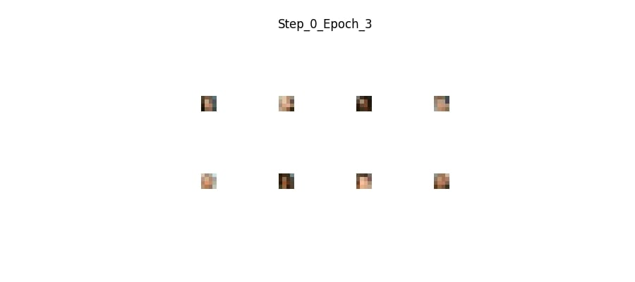

### Step 1 - 8x8 Resolution
**Epoch 1:**
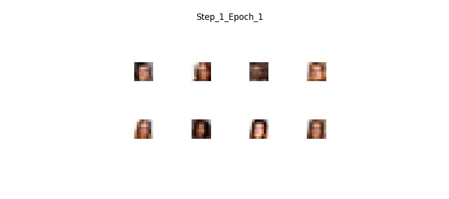

**Epoch 2:**
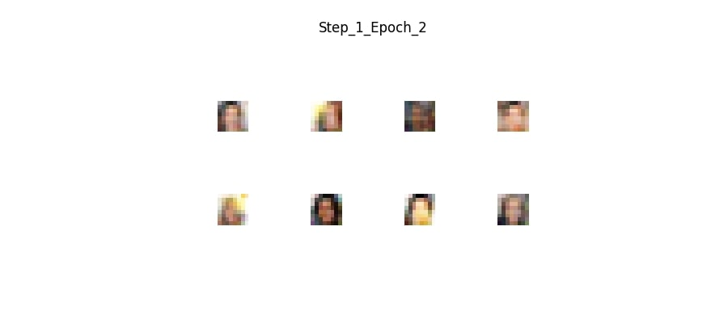

**Epoch 3:**
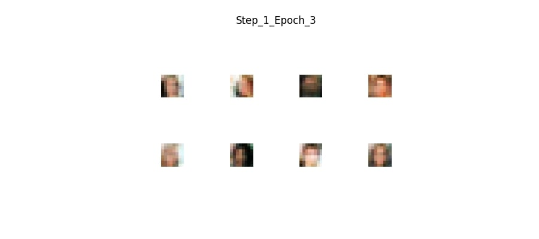

### Step 2 - 16x16 Resolution
**Epoch 1:**
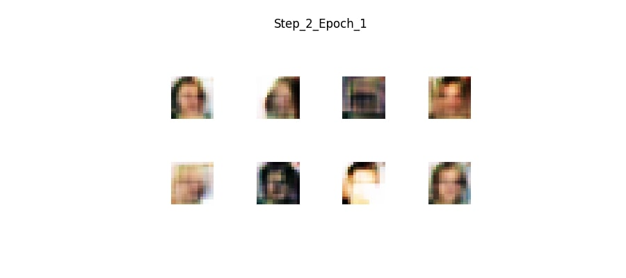

**Epoch 2:**
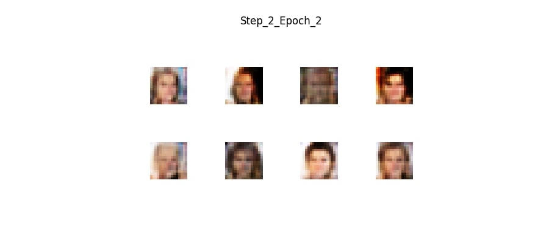

**Epoch 3:**
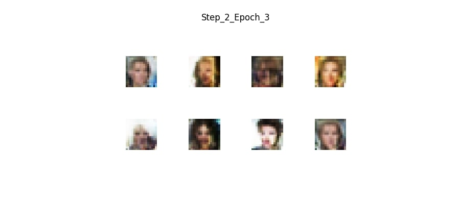

**Epoch 4:**
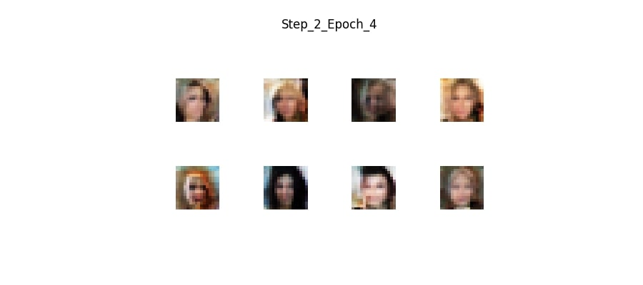

**Epoch 5:**
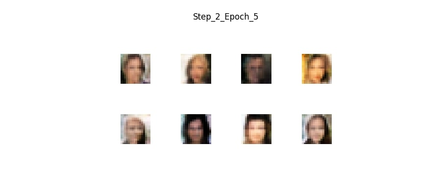

## Model Architecture

### Generator
- **Input**: 512-dimensional noise vector
- **Output**: RGB images at progressive resolutions
- **Parameters**: ~23M trainable parameters
- **Key Components**: WSConv2d layers, PixelNorm, fade-in mechanism

### Discriminator  
- **Input**: RGB images at various resolutions
- **Output**: Real/fake classification score
- **Parameters**: ~25M trainable parameters
- **Key Components**: WSConv2d layers, MiniBatch Standard Deviation, gradient penalty

## Code Structure

```
ProGAN/
├── models.py              # Generator & Discriminator architectures
├── trainer.py             # Training functions and utilities
├── training_model.ipynb   # Main training notebook
├── model_architectures_testing.ipynb  # Architecture testing
├── Models/                # Saved model weights
│   ├── first_generator.pth
│   ├── first_discriminator.pth
│   ├── second_generator.pth
│   └── second_discriminator.pth
└── Results/               # Generated samples and training logs
    ├── model_loss.json
    ├── Epoch results.txt
    └── Step_*_Epoch_*.jpg
```

## Getting Started

### Requirements
```bash
pip install torch torchvision matplotlib tqdm pathlib
```

### Training
1. Prepare your dataset in the `CelebaHQ/` directory
2. Configure hyperparameters in `training_model.ipynb`
3. Run the training notebook:
```python
# Key hyperparameters
START_STEP = 0  # Starting resolution step
END_STEP = 8    # Final resolution step (1024x1024)
LEARNING_RATE = 1e-4
BATCH_SIZES = [16, 16, 16, 16, 16, 8, 5, 4, 2]  # Per resolution step
LATENT_DIM = 512
LAMBDA_GP = 10  # Gradient penalty coefficient
```

### Inference
```python
from models import Generator
import torch

# Load trained generator
generator = Generator(in_channels=512, out_channels=3)
generator.load_state_dict(torch.load('Models/first_generator.pth'))

# Generate samples
with torch.no_grad():
    noise = torch.randn(8, 512, 1, 1)
    generated_images = generator(noise, alpha=1.0, steps=8)
```

## Training Details

- **Loss Function**: WGAN-GP (Wasserstein GAN with Gradient Penalty)
- **Optimizer**: Adam (β₁=0.0, β₂=0.99)
- **Progressive Training**: 10 epochs per resolution step
- **Fade-in**: Smooth transition between resolution steps using alpha blending
- **Mixed Precision**: AMP (Automatic Mixed Precision) for faster training

The model demonstrates stable training progression with smooth transitions between resolution steps, producing high-quality facial images that capture fine details and realistic textures.
