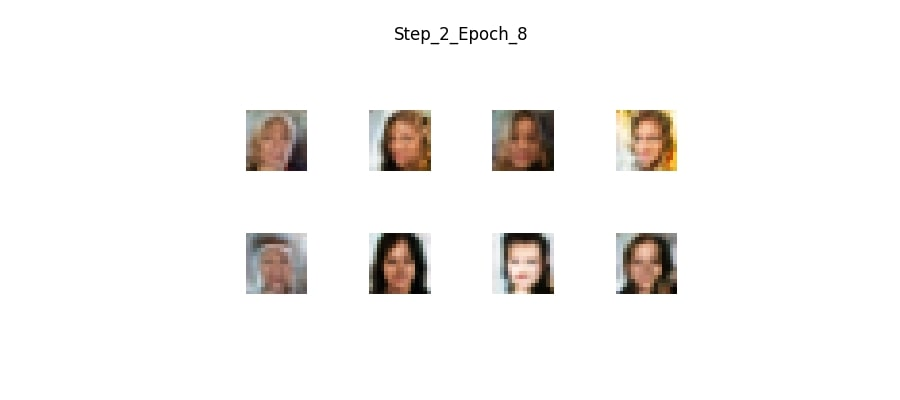

# Progressive GAN - Celeba High Quality Dataset

This repository implements a Progressive GAN (PGAN) trained on the Celeba High Quality dataset. PGAN is designed to generate images starting from a small resolution (4x4) and progressively increase the resolution up to 1024x1024. This approach ensures stable training, allowing the model to generate increasingly detailed images as the resolution grows.

### Model Architecture

**Generator:**
- The generator begins by creating low-resolution images, starting at 4x4 pixels. It then progressively adds more layers that upsample the image to higher resolutions (8x8, 16x16, 32x32, and finally 1024x1024).
- **Weight-scaled convolutional layers** are used to stabilize the training process, ensuring the model learns efficiently across different resolutions.
- **Pixel-wise normalization** is applied after each layer to normalize the activations, preventing large variations in pixel values and improving convergence.
- The generator introduces new layers at each step to increase the image resolution while maintaining coherence in the generated images.

**Discriminator:**
- The discriminator starts at the final resolution (1024x1024) and progressively downsamples the input image to smaller sizes, mirroring the generator's upsampling process.
- The discriminator uses **average pooling** to downsample images and includes **fade-in layers** to smoothly transition from one resolution to another, improving stability during training.
- It also includes a **minibatch standard deviation layer** towards the end, which helps detect mode collapse by encouraging the discriminator to consider diversity in the generated samples.

### Results

The following are the generated images at various stages:

- **4x4 Images** (Step 0, Epoch 3):  
  

- **8x8 Images** (Step 1, Epoch 3):  
  

- **16x16 Images** (Step 2, Epoch 8):  
  

- **32x32 Images** (Step 3, Epoch 20):  
  

- **64x64 Images** (Step 4, Epoch 14):  
  

### How to Run:
1. Clone the repository:
   ```bash
   git clone https://github.com/Ganesh2609/ProGAN.git
   cd ProGAN
   ```
